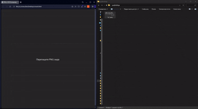

# PNG to SVG Converter / Конвертер PNG в SVG

EN English

## Description

This web application converts PNG images to SVG format. Users can drag and drop a PNG file into the designated area on the page, and the application will automatically create an SVG file for download.

SVG is a vector format that can be scaled without quality loss. The application preserves the original image's proportions by centering it on a 4000×4000 pixel SVG canvas. For non-square images, they will be scaled to fit within these boundaries.

The entire process happens in the browser without uploading files to a server, ensuring privacy and fast performance. Suitable for simple raster-to-vector conversions.

## Features
- Drag-and-drop interface
- Client-side processing (no server upload)
- Preserves image proportions
- 4000×4000 px canvas for high-quality output

## How to Use
1. Drag a PNG file into the drop zone
2. Wait for automatic conversion
3. Download the resulting SVG file

### License
MIT License. See `LICENSE` for details.  

RU Русский

## Описание

Это веб-приложение для конвертации PNG-изображений в SVG-формат. Пользователь может перетащить PNG-файл в выделенную область на странице, после чего приложение автоматически создаст SVG-файл и предложит его скачать.

SVG — это векторный формат, который можно масштабировать без потери качества. Приложение сохраняет пропорции исходного изображения, размещая его в центре SVG-холста размером 4000×4000 пикселей. Если изображение не квадратное, оно будет масштабировано так, чтобы поместиться в эти границы.

Процесс полностью происходит в браузере, без загрузки файлов на сервер, что обеспечивает конфиденциальность и быстроту работы. Подходит для простого преобразования растровых изображений в векторные.

## Возможности
- Интерфейс с перетаскиванием
- Обработка на стороне клиента (без загрузки на сервер)
- Сохранение пропорций изображения
- Холст 4000×4000 пикселей для качественного результата

## Как использовать
1. Перетащите PNG-файл в выделенную область
2. Дождитесь автоматической конвертации
3. Скачайте полученный SVG-файл

### Лицензия
Лицензия MIT. Подробности в файле `LICENSE`.

